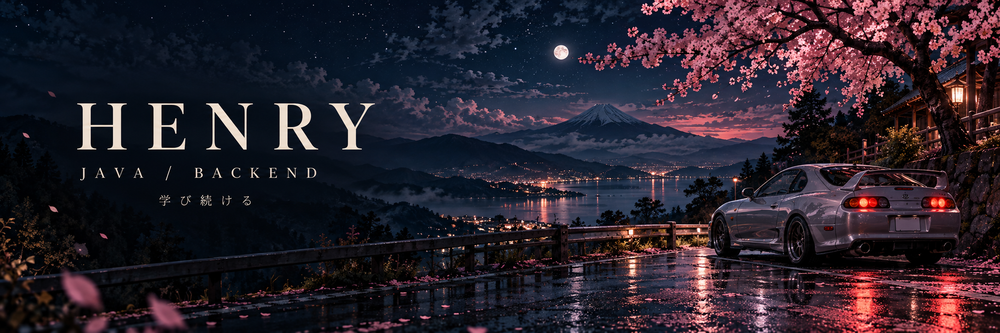
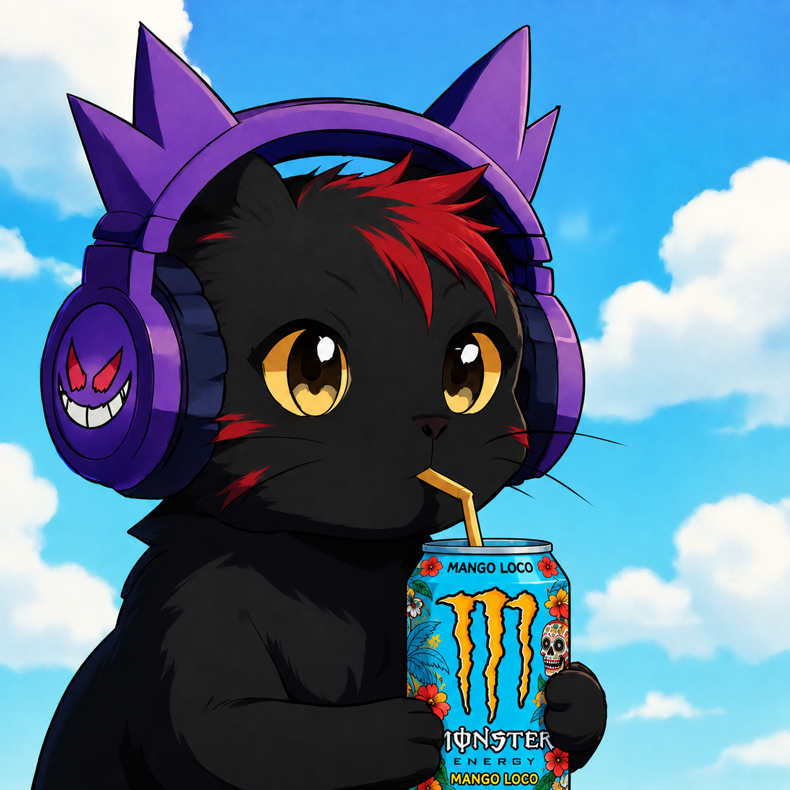
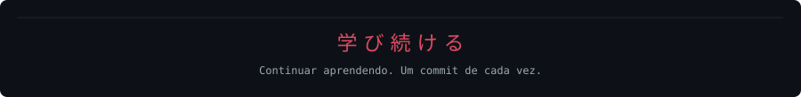

<!-- HENRY / MIDNIGHT GARAGE — imagens e animações próprias em assets/ -->

  
  

  
  
  

### 🌘 &nbsp; About me · はじめまして

**Oi, sou o Henry.** Estudante de ADS e futuro desenvolvedor backend.

Estou construindo minha base em **Java, lógica e orientação a objetos**, transformando o que aprendo em projetos. Busco minha primeira oportunidade em TI e gosto de entender como cada parte do código funciona.

☕ **No editor:** Java e projetos de estudo. 
🌱 **Próxima etapa:** SQL, APIs REST, testes e Spring Boot. 
🎸 **Fora do código:** música, fotografia e jogos.

 

### 🖥️ &nbsp; My workspace

  

IntelliJ para Java · VS Code para interfaces · Git para registrar a evolução

### ⛩️ &nbsp; Tech stack

  
  
  

<b>Foco em Java.</b> Experiência com interfaces nos meus projetos pessoais.

  

### 🏁 &nbsp; Project garage

<table>
<tr>
<td width="50%" valign="top">
<h3>📚 StudyTracker</h3>

Organização de estudos pelo terminal. Um projeto para praticar classes, encapsulamento, coleções e tratamento de exceções.

<code>Java</code> <code>POO</code> <code>ArrayList</code>

</td>
<td width="50%" valign="top">
<h3>⚡ LIFT</h3>

Acompanhamento de treinos, registro de séries, histórico de cargas e cronômetro. Interface com persistência local e recursos de PWA.

<code>React</code> <code>Vite</code> <code>Tailwind</code>

<a href="https://github.com/Henry-DevStack/LIFT-App">Explorar projeto ↗</a>

</td>
</tr>
</table>

### 📈 &nbsp; Code activity

<!-- Dados reais gerados por serviços externos. Podem ficar indisponíveis temporariamente. -->

  
  

  

